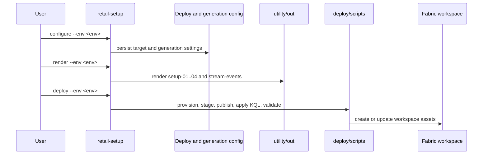
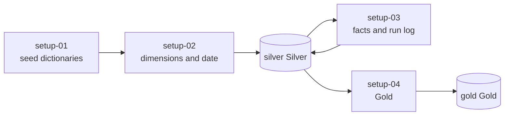
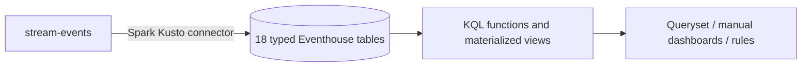
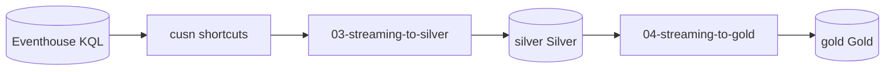
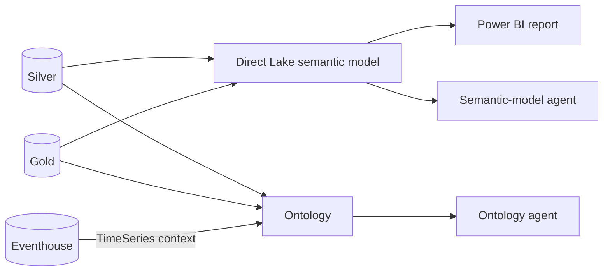

# Data flow

## Configure, render, and deploy

The historical range is normally derived from `months` and ends yesterday.

## Historical setup

This is the supported new-workspace historical path.

## Live Eventhouse path

`unknown_event` is a KQL catch-all table, not a generated business event type.

## Optional Eventhouse-to-Lakehouse projection

This path uses `silver._watermarks`. Its committed pipeline schedule is disabled.
It contains known contract divergence, including streaming-only
`fact_online_order_status`.

## Consumption

## Operational state

Execution and freshness evidence is currently distributed across:

- `setup_run_log`
- `silver._watermarks`
- Fabric notebook/pipeline history
- Eventhouse ingestion state
- ML model output metadata where present

The target unified view is tracked by `IMP-013`.
