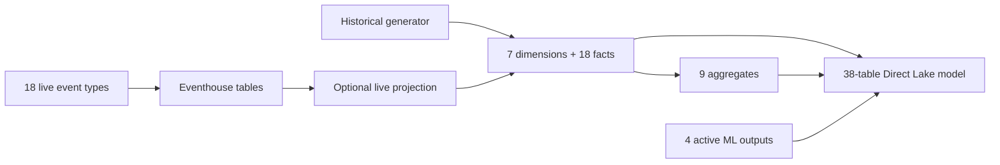

# Data schema

## Ownership

- Base Silver/Gold columns and types:
  `utility/src/retail_setup/generation/schemas.py`
- Live event payload mapping:
  `utility/notebooks/templates/driver-05-stream.py`
- Eventhouse tables:
  `fabric/kql_database/01-create-tables.kql`
- Active semantic-model tables:
  `fabric/powerbi/retail_model.SemanticModel/definition/model.tmdl`

Exact detail belongs in the
[historical data contract](../specifications/modules/generation/data-contract.md),
[event contract](../specifications/modules/streaming/event-contract.md), and
[semantic-model specification](../specifications/modules/power-bi/semantic-model.md).

## Naming reality

New columns use `snake_case`, but the current physical contract includes
PascalCase and mixed-case columns retained for existing TMDL bindings.
`schemas.py` is authoritative for those exceptions.

## Eventhouse

### Business event tables

`receipt_created`, `receipt_line_added`, `payment_processed`,
`inventory_updated`, `stockout_detected`, `reorder_triggered`,
`customer_entered`, `customer_zone_changed`, `ble_ping_detected`,
`truck_arrived`, `truck_departed`, `store_opened`, `store_closed`,
`ad_impression`, `promotion_applied`, `online_order_created`,
`online_order_picked`, and `online_order_shipped`.

### Other KQL tables

- `unknown_event`
- `anomaly_alerts`
- `pricing_recommendation_created`
- `pricing_recommendation_approved`
- `pricing_recommendation_rejected`

The KQL scripts define five core and three pricing materialized views.

## Lakehouse Silver (`silver`)

### Dimensions (7)

`dim_geographies`, `dim_stores`, `dim_distribution_centers`, `dim_trucks`,
`dim_customers`, `dim_products`, `dim_date`.

### Facts (18)

`fact_receipts`, `fact_receipt_lines`, `fact_payments`, `fact_store_ops`,
`fact_foot_traffic`, `fact_ble_pings`, `fact_customer_zone_changes`,
`fact_marketing`, `fact_promotions`, `fact_promo_lines`,
`fact_online_order_headers`, `fact_online_order_lines`, `fact_reorders`,
`fact_truck_moves`, `fact_truck_inventory`, `fact_dc_inventory_txn`,
`fact_store_inventory_txn`, `fact_stockouts`.

### Operational state

- `setup_run_log`
- streaming-only `silver._watermarks`
- current divergent streaming output `fact_online_order_status`

`fact_online_order_status` is not part of the base contract or active semantic
model.

## Lakehouse Gold (`gold`)

`sales_minute_store`, `top_products_15m`, `inventory_position_current`,
`dc_inventory_position_current`, `truck_dwell_daily`, `online_sales_daily`,
`zone_dwell_minute`, `marketing_cost_daily`, `tender_mix_daily`.

## Semantic model

The Direct Lake model has 38 active tables:

- 7 dimensions
- 18 facts
- 9 Gold aggregates
- 4 ML outputs: `churn_predictions`, `customer_segments`, `demand_forecast`,
  `stockout_risk`

