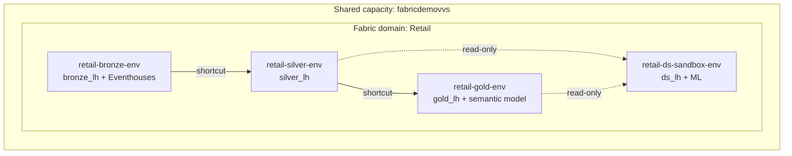

# Governance topology

The retail demo is being re-architected from a single Fabric workspace into a
**governed medallion topology**: separate workspaces per medallion layer, Entra
security groups with least-privilege access, a `Retail` Fabric domain, and
per-workspace cost chargeback on a single shared capacity.

This page is the canonical narrative for that topology. The machine-readable
source of truth is [`deploy/config/topology.yml`](https://github.com/amattas/retail-demo/blob/main/deploy/config/topology.yml);
the infrastructure that provisions it lives in
[`deploy/terraform/governance/`](https://github.com/amattas/retail-demo/blob/main/deploy/terraform/governance/).

## Locked decisions

| ID | Decision |
| --- | --- |
| D1 | Design for `dev` / `test` / `prod`; implement `dev` first. |
| D2 | Each layer **physically owns** its curated tables in its own lakehouse. |
| D3 | A **single shared capacity** (`fabricdemovvs`); cost is attributed per workspace via the Fabric Chargeback app. |
| D4 | Report consumers get a **Power BI App audience**, not a workspace role. |

## Workspace topology

Workspace names are **derived** from `retail-{layer}-{env}`. Because the derived
names never match `retail-demo-dev`, the existing (immutable) workspace can never
be targeted by construction.

Cross-layer reads are **OneLake shortcuts**, not data copies. Each layer writes
only to its own lakehouse (D2).

## Entra security groups

Seven security groups (Phase 1). Object IDs are resolved from the display names
at deploy time; they are never hard-coded.

| Group | Purpose |
| --- | --- |
| `sg-fabric-retail-platform-admins` | Governance / platform team (workspace Admins). |
| `sg-fabric-retail-data-eng` | Data engineering. |
| `sg-fabric-retail-data-sci` | Data science. |
| `sg-fabric-retail-analysts` | BI / analytics developers. |
| `sg-fabric-retail-ai-apps` | Service principals for AI applications. |
| `sg-fabric-retail-report-users` | Reporting consumers (Power BI App audience). |
| `sg-fabric-retail-deploy-sp` | CI/CD deploy service principal(s). |

## RBAC matrix

Least privilege: a group with no cell in a layer gets **no role** there. Roles
are `Admin`, `Member`, `Contributor`, `Viewer`.

| Group | bronze | silver | gold | ds-sandbox |
| --- | --- | --- | --- | --- |
| platform-admins | Admin | Admin | Admin | Admin |
| data-eng | Member | Member | Contributor | Viewer |
| data-sci | — | Viewer | Viewer | Member |
| analysts | — | Viewer | Contributor | — |
| deploy-sp | Admin | Admin | Admin | Admin |
| ai-apps | — (item / OneLake grants) | | | |
| report-users | — (Power BI App audience, D4) | | | |

`ai-apps` and `report-users` deliberately receive **no** workspace role. AI
applications get item-level and OneLake data-access grants on Gold; report
consumers get a Power BI App audience published from the Gold workspace (D4).
This matches the `rbac_matrix` in `deploy/terraform/governance/rbac.tf` and the
`rbac` block in `deploy/config/topology.yml`.

## Item → layer mapping

Which repository items belong to which layer workspace. Setup and stream
notebooks are parameterized (via `retail-setup render`) to target the owning
layer's lakehouse.

### `retail-bronze-<env>` — raw landing, real-time ingestion, event stores

- Retail Eventhouse + KQL schema — `fabric/kql_database/`
- Clickstream Eventhouse + Eventstream — `deploy/terraform/clickstream.tf`
- Live event generator — `utility/notebooks/stream-events.ipynb`
- Clickstream generator — `utility/notebooks/clickstream-generator.ipynb`
- Bronze shortcut builder — `fabric/lakehouse/01-create-bronze-shortcuts.ipynb`
- Historical raw load — `fabric/lakehouse/02-historical-data-load.ipynb`
- Ingestion pipelines — `fabric/pipelines/{historical-data-load,streaming-data-load}.DataPipeline`
- Real-time querysets — `fabric/querysets/`
- Real-time dashboards — `fabric/dashboards/{retail-ops,pricing-approval}.template.json`
- Dictionary seeds — `utility/notebooks/setup-01-seed-dictionaries.ipynb`

### `retail-silver-<env>` — cleansed / conformed

- Streaming → silver transform — `fabric/lakehouse/03-streaming-to-silver.ipynb`
- Historical dimensions — `utility/notebooks/setup-02-generate-dimensions.ipynb`
- Historical facts — `utility/notebooks/setup-03-generate-facts.ipynb`
- Receipt augment / dedupe — `fabric/lakehouse/90-augment-and-dedupe-receipts.ipynb`
- Delta maintenance — `fabric/lakehouse/05-maintain-delta-tables.ipynb`
- Reverse-ETL (opt-in) — `fabric/lakehouse/{50-silver-to-azuresql-oltp,51-silver-to-blob-csv}.ipynb`
- Shortcuts → bronze

### `retail-gold-<env>` — aggregates, semantic model, agents, reporting

- Streaming → gold transform — `fabric/lakehouse/04-streaming-to-gold.ipynb`
- Gold aggregate build — `utility/notebooks/setup-04-build-gold.ipynb`
- Direct Lake semantic model — `fabric/powerbi/retail_model.SemanticModel` (rebound to `gold_lh`)
- Report — `fabric/powerbi/retail_model.Report`
- Data agent — `fabric/data-agents/retail-semantic-model-agent.DataAgent`
- Ontology — `fabric/lakehouse/30-create-ontology.ipynb`
- Maintenance orchestration — `fabric/pipelines/daily-maintenance.DataPipeline`
- Shortcuts → silver; Power BI App audience → `sg-fabric-retail-report-users` (D4)

### `retail-ds-sandbox-<env>` — experimentation + ML

- ML notebooks — `fabric/lakehouse/06-ml-demand-forecast.ipynb` … `14-ml-dynamic-pricing.ipynb`
- ML orchestration — `fabric/pipelines/machine-learning.DataPipeline`
- Reset (sandbox hygiene) — `fabric/lakehouse/99-reset-lakehouse.ipynb`
- Read-only shortcuts → silver + gold; writes only `ds_lh`

## IaC scope boundary

!!! warning "The immutable workspace"
    The existing `retail-demo-dev` workspace is **immutable**. No Terraform
    resource, `fabric-cicd` target, `retail-setup` step, or config value in this
    topology references, reads, writes, re-points, or deletes it.

The governance IaC provisions **infrastructure** (workspaces, domain, RBAC,
capacity assignment, lakehouses, eventhouses, Spark), publishes **items**, and
**generates fresh synthetic data** only. It **excludes any copy from
`retail-demo-dev`**. A clean deploy must succeed with `retail-demo-dev` absent.

Migrating existing data out of `retail-demo-dev` is a separate, one-off,
read-only runbook (see the migration runbook), archived after cutover — it is
**not** part of the repeatable IaC.

The boundary is enforced by construction: target workspace names are *derived*
from `retail-{layer}-{env}`, so there is no configuration key that resolves to
the old workspace.

## Rollout status

This is an **additive** foundation. The configuration and Terraform above define
the target topology; the current single-workspace deploy path
(`deploy/config/deploy.yml` + `environments/*.yml`) remains the active
deployment mechanism until the multi-workspace orchestration is wired in.
Implement `dev` first (D1), then stand up `test` / `prod` with the same pattern.
