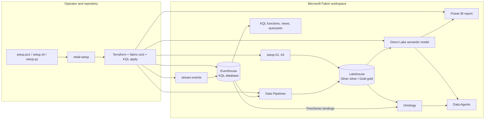

# Architecture overview

## Purpose

The repository delivers a Microsoft Fabric retail demo with two active modes:

1. Fabric-native historical setup through `retail-setup` and setup notebooks.
2. Optional live RTI through `stream-events.ipynb` writing directly to
   Eventhouse/KQL.

## Primary historical path

`setup-01` through `setup-04` seed dictionaries, generate dimensions and facts,
and build Gold directly in the Lakehouse. This path does not require ADLS
parquet shortcuts or the retained historical-load notebook.

## Optional live path

`stream-events` emits eighteen typed business event types to Eventhouse through
the Spark Kusto connector. KQL supplies the hot query path. Optional
Eventhouse shortcuts and streaming transforms project events into Lakehouse
Silver and Gold.

## Contract owners

- Setup behavior: [CLI specification](../specifications/modules/setup/cli.md)
- Deploy inventory: [deployment framework](../specifications/modules/deployment/framework.md)
- Base Lakehouse schema: [historical data contract](../specifications/modules/generation/data-contract.md)
- Event envelope and payloads: [live event contract](../specifications/modules/streaming/event-contract.md)
- KQL and medallion transforms: [Fabric analytics](../specifications/modules/analytics/fabric-analytics.md)
- Power BI: [semantic model](../specifications/modules/power-bi/semantic-model.md)
- Ontology and agents: [ML and AI contracts](../specifications/modules/ml-ai/model-contracts.md)

## Current support boundaries

- The deploy plan currently mixes core, ML, ontology, reset, and stream groups.
- Dashboard and rule assets are not yet guaranteed first-class deployable items.
- The semantic model is Direct Lake and has 38 active tables, including four ML
  outputs.
- `fact_online_order_status` is a streaming-only Silver output outside the base
  table contract.
- Security, deployment, KPI, and runtime-readiness gaps remain visible in the
  owning module backlogs.
